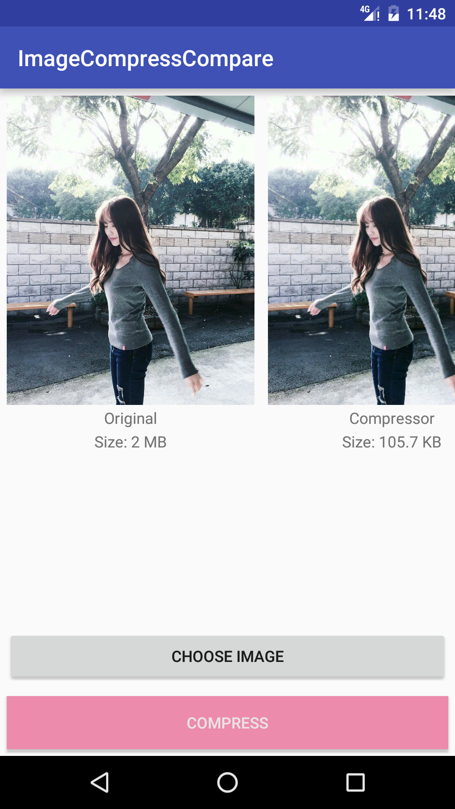

Compare the most popular image compresser on Github.

比较了下主流的[图片压缩库](#指的是哪些库)的效果。具体效果各位自行判断（本人开启写轮眼模式，觉得compressor的表现更稳定，鲁班压缩的图片有出现涂抹感强、失真的现象，压缩比也略逊一筹）

---

## 对比的是哪些库？
[Compressor](https://github.com/zetbaitsu/Compressor)、[鲁班](https://github.com/Curzibn/Luban)

## 如何添加新的压缩方法？
在`MainActivity`中的`compressType`变量中加入新的压缩名字，并且用这个名字写一个压缩方法即可。

