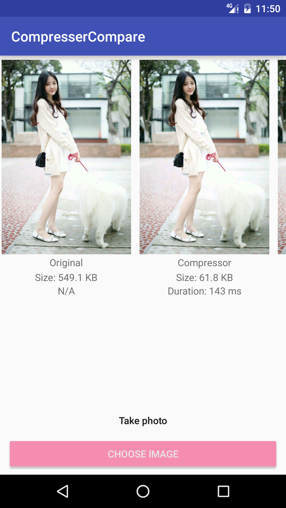

Compare the most popular image compresser on Github.

比较了下主流的[图片压缩库](#对比的是哪些库？Which repos?)的效果。具体效果各位自行判断（本人开启写轮眼模式，觉得compressor的表现更稳定，时间(Duration)上完胜后者，压缩比也略逊一筹，但是鲁班有些图片压缩的效果较好地保留了细节）

---

## 对比的是哪些库？Which repos?
[Compressor](https://github.com/zetbaitsu/Compressor)、[鲁班](https://github.com/Curzibn/Luban)

## 如何添加新的压缩方法？Adding new compress method?
在`MainActivity`中的`compressType`变量中加入新的压缩名字，并且用这个名字写一个压缩方法即可。

Add new String of method's name to `compressType` in `MainActivity`, and corresponding compress method with the same name.

